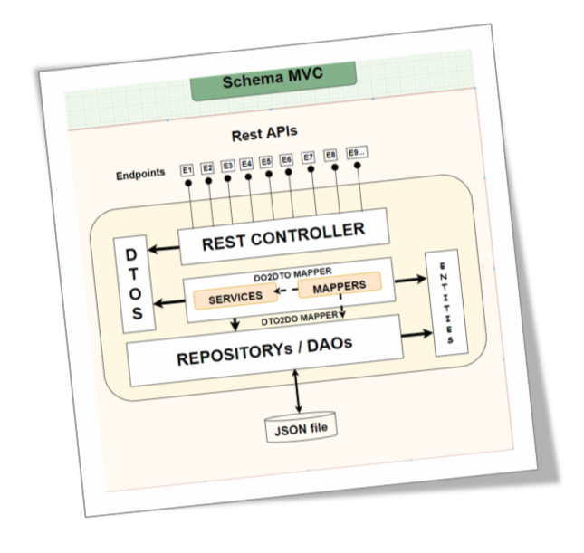
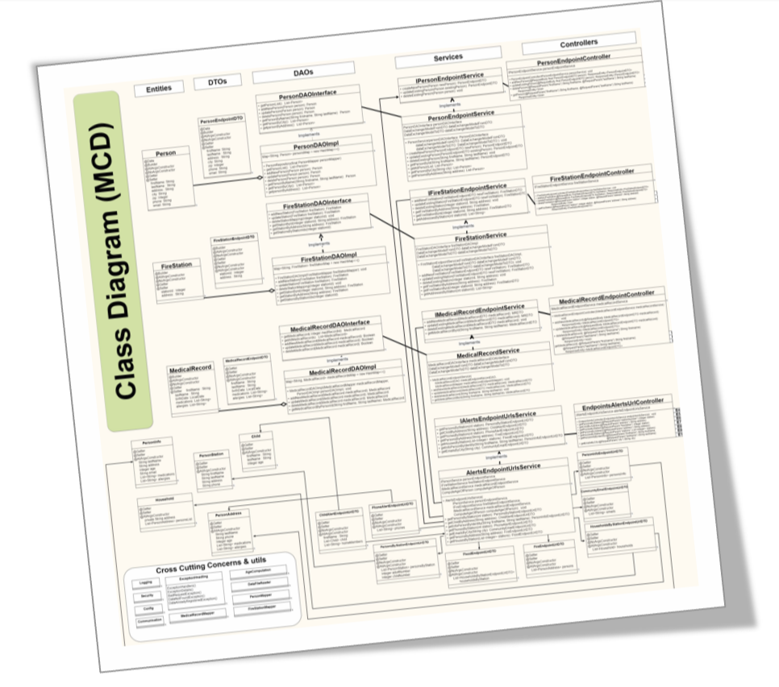
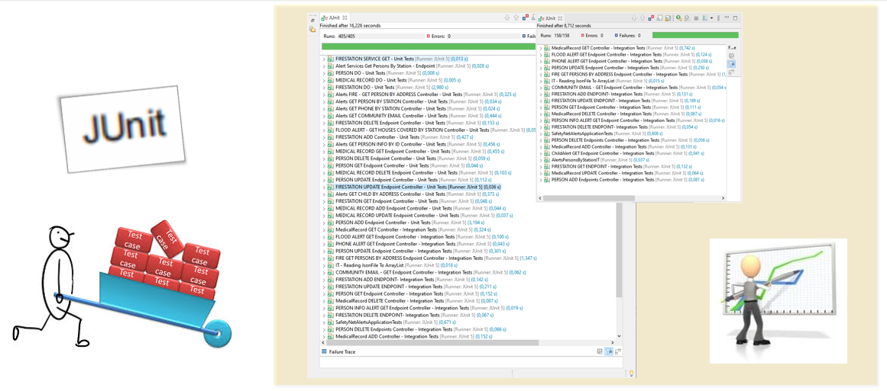
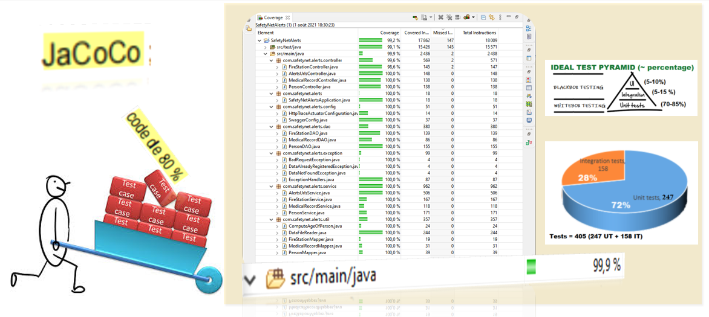
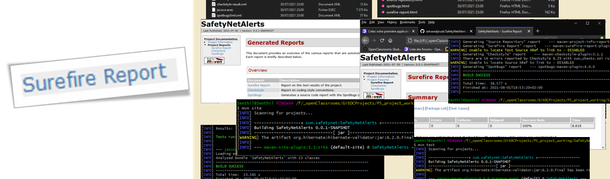
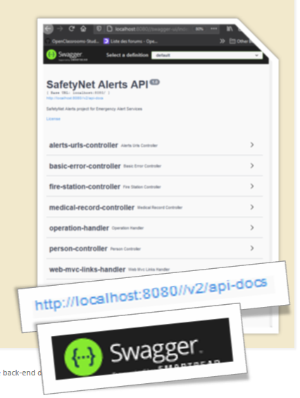
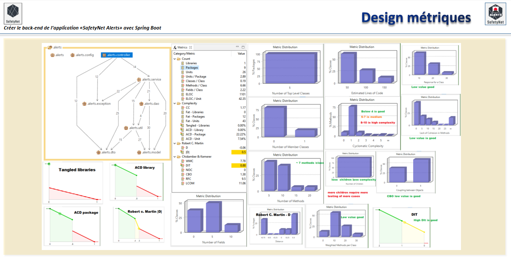

 

 

SafetyNet Alerts
================
---

 

Description
-----------
[An Backend](https://img.shields.io/badge/microservices-Backend%20API-orange) application to provide pertinent ALERT information to emergency services for effective disaster management. 

Technical Specification Toolbox
---------------------
 
 
 
 

  

 

 

Input
-----
JSON data file  

Project Milestones
===
Outputs
-------
 providing ALERTS with pertinent information to various emergency services in time. 

Preliminary Design Sketches
===

Class Design - MCD
===

Maven Unit tests
===

Jacoco tests coverage report
===

SureFire tests report
===

Swagger API documentation
===

STAN Design metrics (SOLID principle based development)
===

### Reference Documentation
For further reference, follow the below links:

* [Spring Boot Actuator Web API Documentation] (https://docs.spring.io/spring-boot/docs/2.4.2/actuator-api/htmlsingle/#overview-endpoint-urls)
* [Spring Boot 2.4.2 API] (https://docs.spring.io/spring-boot/docs/2.4.2/api/)
* [Package org.springframework.boot.maven] (https://docs.spring.io/spring-boot/docs/2.4.2/maven-plugin/api/)
* [Spring Boot Maven Plugin Documentation] (https://docs.spring.io/spring-boot/docs/2.4.2/maven-plugin/reference/htmlsingle/)
* [Spring Boot Reference Documentation] (https://docs.spring.io/spring-boot/docs/2.4.2/reference/htmlsingle/)
* [Creating API Documentation with Restdocs] (https://spring.io/guides/gs/testing-restdocs/)
* [Testing the Web Layer] (https://spring.io/guides/gs/testing-web/)
* [Accessing JPA Data with REST] (https://spring.io/guides/gs/accessing-data-rest/)
* [Metrics and Tracing with Spring] (https://spring.io/guides/tutorials/metrics-and-tracing/)
* [Building REST services with Spring] (https://spring.io/guides/tutorials/rest/)
* [Building a RESTful Web Service] (https://spring.io/guides/gs/rest-service/)
* [Serving Web Content with Spring MVC] (https://spring.io/guides/gs/serving-web-content/)
* [...] (....)
